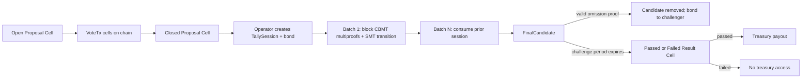
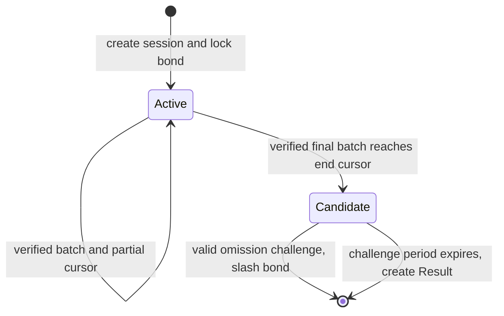
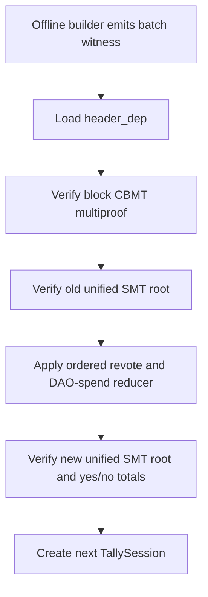

# On-chain Voting with Optimistic Batch Settlement

## Status

This document describes the V3 tally-witness implementation in `impl/`. Voting transactions,
batch verification, challenges, passing-policy evaluation, treasury payout, burn,
and grant timelocks execute in CKB-VM. The CKB node does not maintain a tally
index and does not scan historical voting windows during transaction validation.

## Architecture



The result transaction and treasury payout are separate. This keeps vote
settlement independent from Treasury Cell selection and allows a passed result to
be consumed exactly once by the payout transaction.

## Cells and scripts

- **Proposal Cell**: a Type-ID singleton. It moves from `Open` to `Closed`, then
  is consumed with one mature FinalCandidate to create one Result Cell.
- **Vote Cell**: records `YES` or `NO`, the claimed amount, and DAO cell-dep
  indices. Its type args contain the full Proposal type-script hash. The
  Proposal binds the DAO code hash and hash type, so the contract is not tied to
  one genesis or network. A DAO outpoint cannot simultaneously be a VoteTx
  `cell_dep` and an input; both the Vote Script and tally reducer reject this.
- **TallySession Cell**: a Type-ID singleton owned logically by one operator. Its
  capacity is the settlement bond. Each batch consumes the previous session and
  creates the next state.
- **Result Cell**: evaluated by a versioned Policy Type Script. A passed result may
  only be consumed in a transaction containing the configured Treasury Lock.
- **Treasury Cell**: created by CKB consensus using one fixed Treasury Lock. It can
  be spent by a passed result or burned after expiry.
- **Grant Cell**: optional payout lock with an absolute block timelock and a
  beneficiary lock hash.
- **Config Cell**: an immutable Type-ID cell. A policy upgrade creates a new
  Config Cell and therefore a new script hash; existing proposals keep their old
  rules.

## VoteRecord

`VoteRecord` is the preimage committed as the value of a voter leaf in the vote
SMT. It is not merely a cached vote count.

```text
VoteRecord {
    voter_lock_hash: Byte32,
    direction:       0 | 1,
    amount:          Uint64,
    block_number:    Uint64,
    tx_index:        Uint32,
    dao_out_points:  Vec<OutPoint>,
}
```

The unified state SMT uses separate vote, DAO, and event key namespaces. Each
physical key is `blake2b("CKB Treasury state key V1" || namespace || logical_key)`,
so the namespaces retain the full hash output instead of reserving or truncating
key bits. The vote namespace stores `voter_lock_hash -> blake2b(VoteRecord)`,
while the DAO namespace stores `dao_out_point_key -> voter_lock_hash`. When a
voter votes again, the batch witness reveals the old VoteRecord, proves that its
hash is the current vote-leaf value, removes all old DAO mappings and old weight,
then installs the new record. When a referenced DAO deposit is spent, the DAO
leaf identifies the voter and the same VoteRecord provides the complete list of
mappings and weight to remove.

This preimage is required because an SMT value hash alone cannot tell the
contract which DAO outpoints must be deleted during revote or invalidation.

## Tally state

Each TallySession commits to one domain-separated SMT with three logical namespaces:

- vote: voter lock hash to VoteRecord hash;
- DAO: DAO outpoint key to voter lock hash;
- event: historical transaction hash to `EVENT_PRESENT`.

The current fixed-length `TallyState` layout retains the `votes_root`, `dao_root`,
and `events_root` fields, but V3 requires all three fields to contain the same
unified state root. A transition or candidate with unequal roots is invalid. This
keeps the state layout stable while reducing each non-empty batch to one compiled
SMT proof verified against both the old and new roots.

It also stores the next scan cursor, sequence number, `yes`, `no`, processed event
count, operator lock hash, and candidate start block.



Only a transaction containing an input with the operator lock hash may advance or
finalize the session. A challenge is permissionless. Competing operators may
create independent sessions, but only one can consume the singleton Closed
Proposal during finalization.

## Batch witness verification

A batch contains only relevant historical transactions: VoteTxs and transactions
that spend a currently tracked DAO outpoint. Events are grouped by block. Each
block group carries:

- block number, `header_dep` index, total transaction count, and witnesses root;
- strictly increasing transaction indices and each serialized RawTransaction;
- one CBMT multiproof shared by all included transactions from that block.

The contract performs the following checks:

1. Load each referenced header once and match its block number.
2. Hash every RawTransaction and verify the block-level CBMT multiproof with each
   hash bound to its strictly ordered transaction index.
3. Combine the computed raw-transaction root and supplied witnesses root, then
   require the result to equal the header's `transactions_root`.
4. Verify one compiled SMT proof against both the old and new unified roots for
   every touched, domain-separated key.
5. Re-run the reducer in `(block_number, tx_index)` order.
6. Require the recomputed leaf values, totals, event count, cursor, roots, and next
   phase to equal the output TallySession.



The proposal fixes `max_events_per_batch`, `max_dao_deps_per_vote`,
`max_state_keys_per_batch`, `max_batch_witness_bytes`, and
`max_batch_sequence`. These are consensus-enforced limits, not SDK hints.

An empty batch is valid only when it preserves the unified root in all three
layout fields, both tally totals, and carries no transitions, prior records, or
SMT proofs. This lets a
no-vote proposal, or an empty suffix of a voting window, reach `FinalCandidate`
without granting the operator any ability to alter state.

## Off-chain operator path

The Rust `tally-builder` includes a blocking CKB RPC adapter. It requests each
canonical block in serialized Molecule form, recomputes the raw-transaction and
witness CBMT roots, checks them against the header, and scans transactions in
chain order. Temporary vote and DAO state is carried across blocks, so a DAO
deposit spent in a later block removes a vote found earlier in the same batch.
Consecutive RPC blocks must also form one parent-hash chain; a reorg during a
scan causes an immediate retry instead of producing a mixed-branch batch.

The scanner returns the proven events, next cursor, candidate anchor, and the
ordered header hashes that the transaction assembler must use as `header_deps`.
`CkbRpcClient` also submits a signed, assembled CKB transaction with the
`passthrough` output validator. Wallet selection, fee inputs, signing, and the
final transaction layout remain caller responsibilities.

## Why the final candidate is optimistic

CBMT proofs prove that every submitted event exists, but they cannot prove that
the operator submitted every relevant event. Intermediate batches therefore do
not wait for a challenge period. The complete event namespace is challenged only
after the final cursor is reached.

Two V3 challenges are supported:

- **Omitted vote**: prove a VoteTx is included in the voting window and prove its
  transaction hash is absent from the event namespace.
- **Omitted DAO spend**: prove that the final DAO namespace still maps an outpoint
  to a nonzero voter, prove a transaction in the voting window spends that
  outpoint, and prove the spend transaction is absent from the event namespace. This
  final-state condition prevents an obsolete outpoint from an earlier,
  superseded vote from producing a false challenge.

A successful challenge consumes the candidate and pays its entire bond to the
challenger. It does not rewrite history. Another operator can start a fresh
session from the Closed Proposal.

## Passing policy

The Result Type Script loads an immutable Policy Config Cell and evaluates:

```text
total = yes + no
passed = requested_amount <= maximum_proposal_amount
      && total >= minimum_total_votes
      && yes * 10_000 >= total * approval_bps
```

The Policy Config data hash is committed in the Result Cell. Changing policy
means deploying a new immutable config version and creating future proposals
that reference the new Policy script hash. Node Rust code is unaffected.

## Treasury payout and burn

The node keeps `secondary_epoch_reward` unchanged and materializes only future
would-be-burned issuance after activation. Historical burned CKB is never
recreated. Multiple target blocks are aggregated before one Treasury Cell is
emitted.

For payout, the Treasury Lock requires exactly one passed Result input. If the
Treasury inputs sum to `T` and the proposal requests `A`, the transaction must
create:

- exactly one receiver output with capacity `A`; and
- zero or one Treasury change output with capacity `T - A`.

Treasury capacity cannot pay transaction fees; external inputs fund fees.

For burn, every Treasury input must use a relative block-number `since` at least
`burn_expiry_blocks`. The transaction creates one configured zero-lock output
and one caller incentive output. Their capacities must sum exactly to the
Treasury inputs. The incentive is:

```text
min(
  base_burn_incentive
    + (relative_blocks - burn_expiry_blocks) * burn_incentive_rate,
  maximum_burn_incentive
)
```

The fixed Treasury lock args contain the immutable Treasury Config type hash.
Treasury creation height is not encoded in args; relative `since` uses each
input Cell's actual creation point and naturally resets for Treasury change.

## Implemented verification

- Rust unit tests cover canonical codecs, VoteRecord commitments, policy math,
  single and block-level CBMT proofs, state-key namespaces, and old/new SMT
  transition proofs.
- `ckb-testtool` rejects duplicate or unsorted transaction indices, added or
  removed CBMT lemmas, wrong block headers, and modified RawTransactions.
- `ckb-testtool` executes a builder-generated final batch in CKB-VM.
- `ckb-testtool` executes an omitted-vote challenge and bond slash.
- `ckb-testtool` executes exact Treasury payout and expired burn paths.
- CKB node tests cover activation, issuance decomposition, derived-state replay,
  Cellbase creation, full block reward verification, and canonical reorg behavior.
- The reproducible `live-e2e` runner starts the current Treasury-enabled CKB
  binary and submits real transactions through RPC, tx-pool, proposal, block
  assembly, and block verification. It mines DAO deposits, an open/closed
  proposal, and VoteTxs; accepts and then slashes an omitted-vote candidate;
  accepts the complete candidate; finalizes a passed Result Cell; and consumes a
  consensus-created Treasury Cell for payout.
- In the validated run, the incomplete candidate and challenge committed in
  blocks 56 and 60. The complete candidate, finalization, and payout committed in
  blocks 68, 72, and 76. The tally was 2,100 CKB YES and 0 NO; the payout sent
  100 CKB and preserved the exact Treasury change.
- The RPC adapter accepts both current 5-field Molecule `BlockV1` responses and
  legacy 4-field `Block` responses, and verifies their transaction roots before
  building proofs.

Remaining production work includes deployment manifests, production
wallet/signing and transaction-assembly tooling, complex-event benchmarks,
larger multi-batch soak tests, and final parameter selection.
